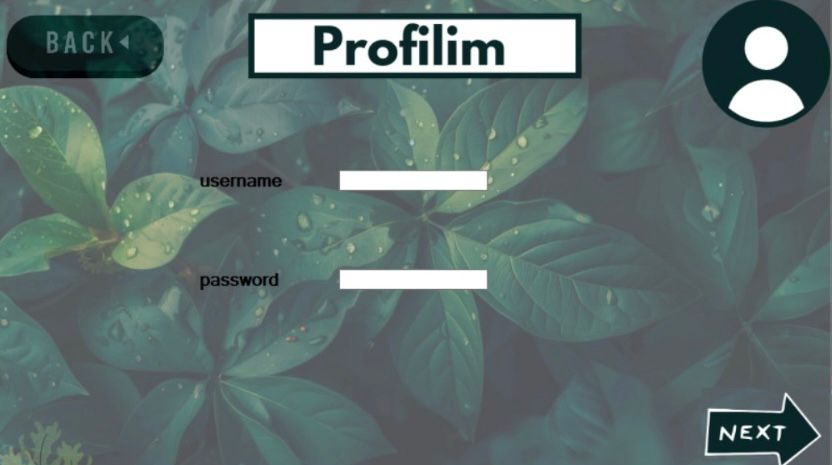
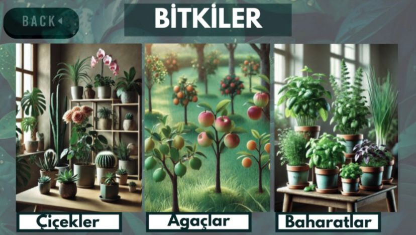
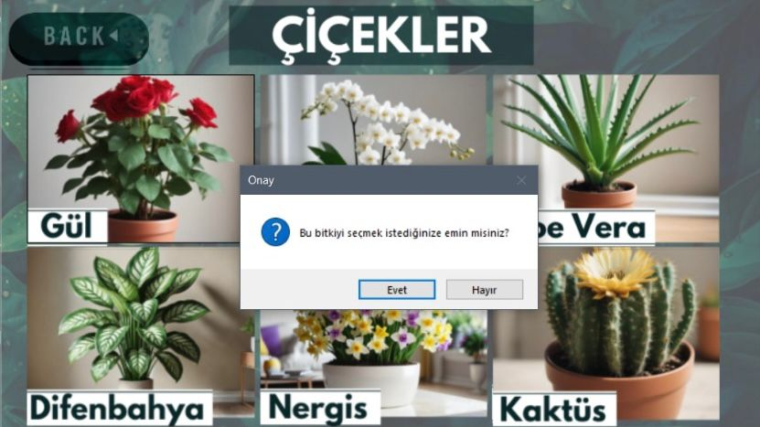
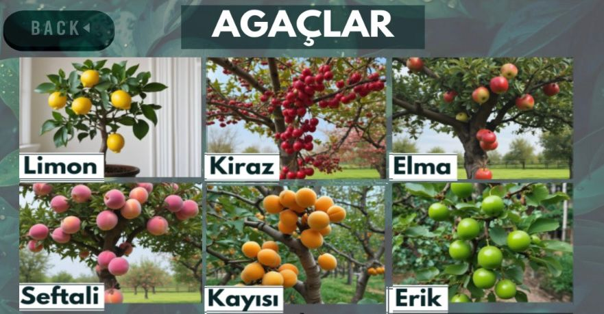
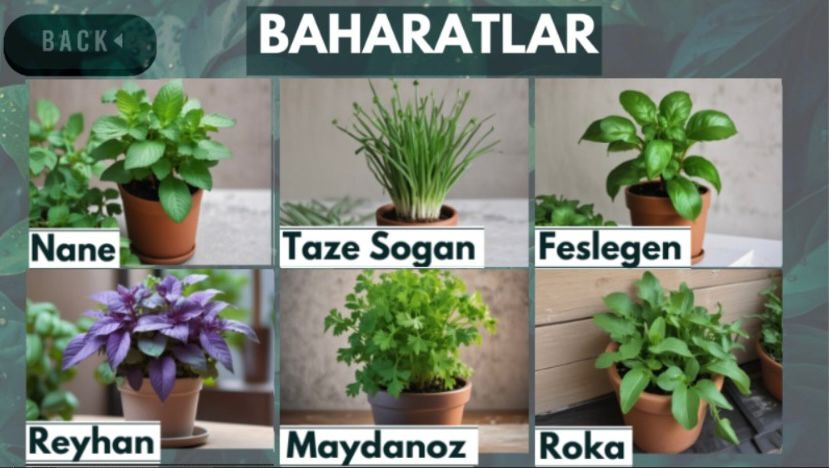

## 🌿 Plant Tracking System
---
- Plant Tracking System is a Windows Forms desktop application that helps users manage and monitor plant care processes such as watering, fertilizing, light requirements, and temperature conditions.
- The application allows users to create a profile, select plant categories, add plants to their personal list, and view detailed care requirements.

---
## 🛠️ Technologies Used

- C#
- Windows Forms
- Microsoft Access
- Observer Design Pattern
---
## ✨ Features

- Create and manage a personal user profile  
- Browse plant categories such as Flowers, Trees, and Spices  
- Add selected plants to a personalized plant list  
- View detailed care requirements including watering, fertilizing, light, and temperature conditions  
- Fully offline desktop application with local database support

---

## 🎯 Project Objectives

- Simplify and streamline plant care management processes  
- Provide structured monitoring of plant growth and environmental conditions  

---

## 📸 Application Screenshots

---
### 🏠 Main Screen

---

### 👤 Profile Screen

---

### 🌿 Plant List Screen

---

### 🌸 Flowers Category

---

### 🌳 Trees Category

---

### 🌿 Spices Category

---

## 👩‍💻 Development Team

Developed as a collaborative academic project by:

- Ümit Demir  
- Elif Ergen  
- Rüveyda Çiftci  
- Aziz Bolat

 --- 

